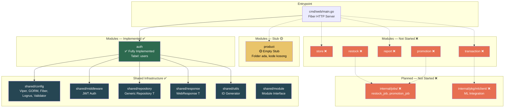
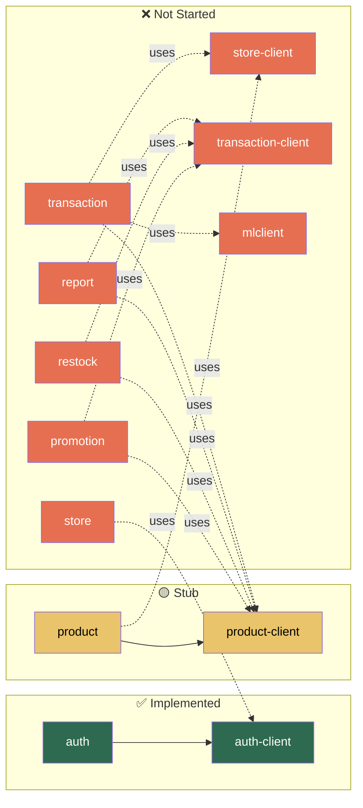
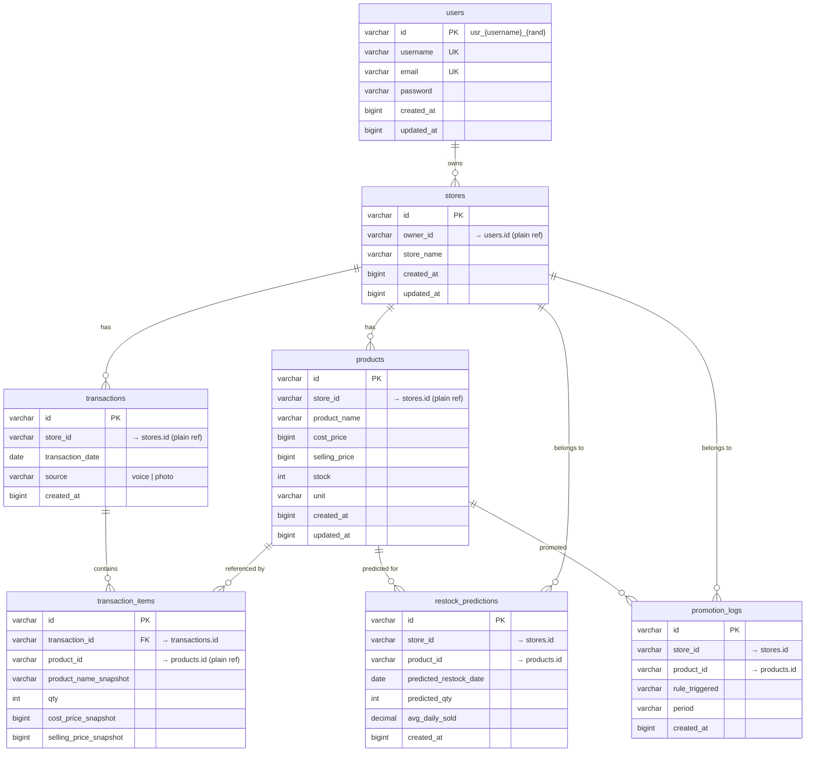
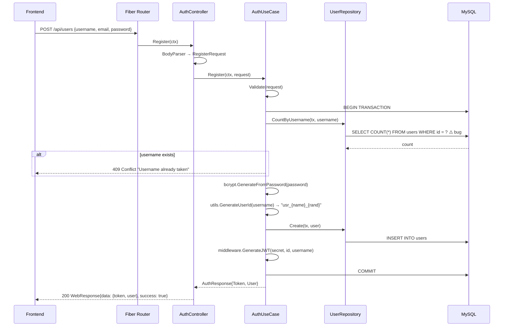
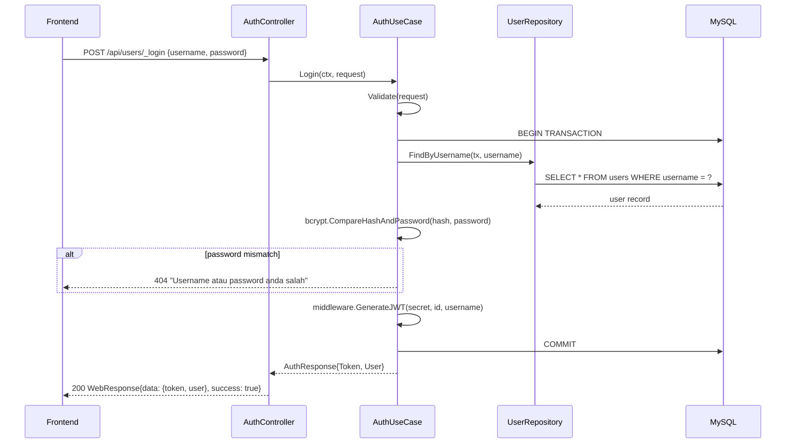
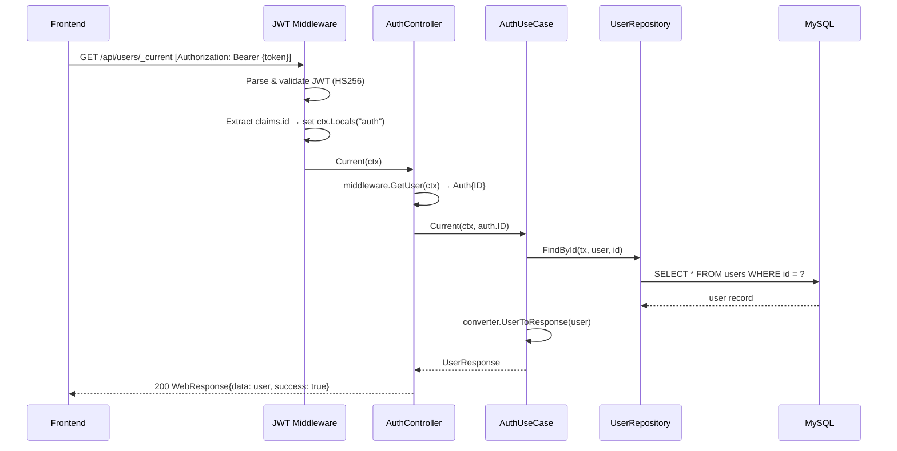
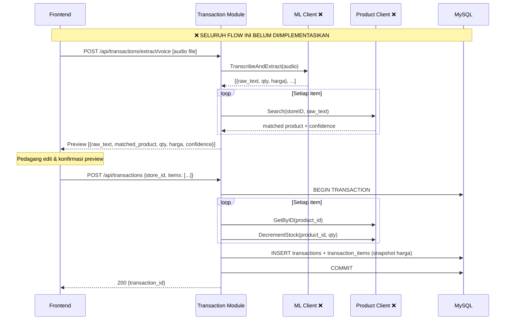
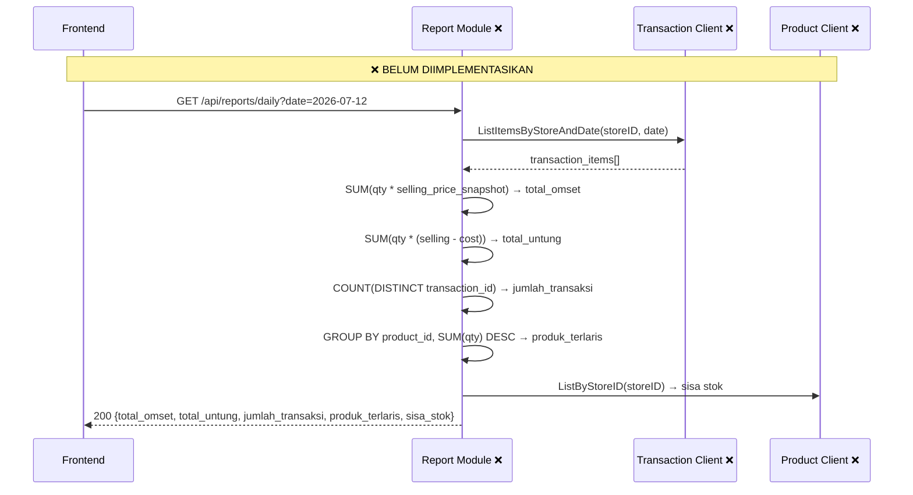
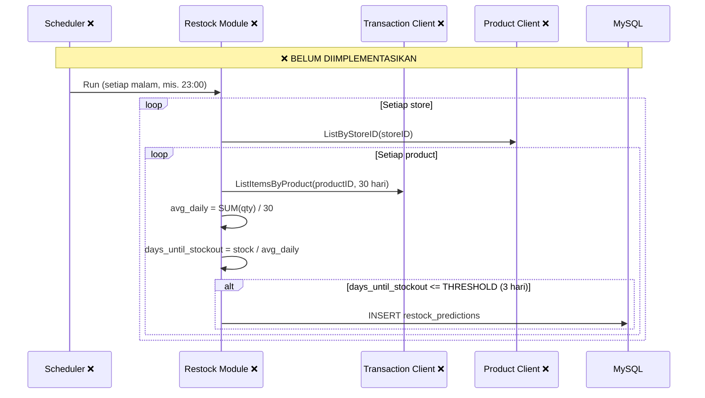
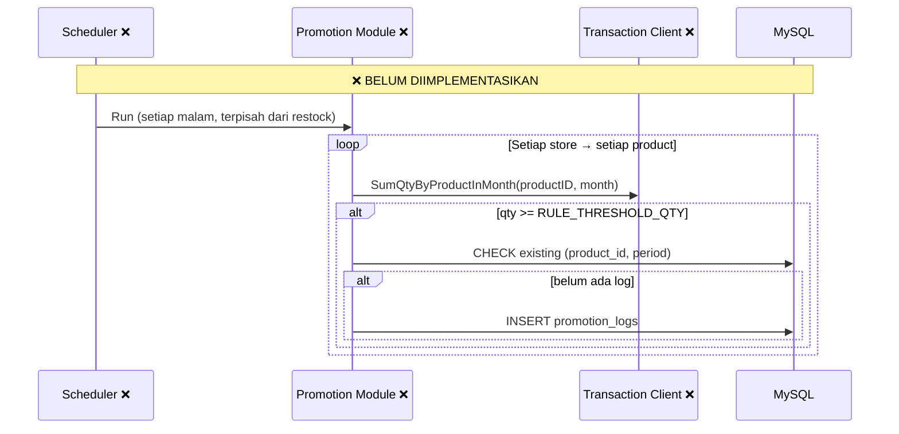

# System Map — Smart Commerce Backend

_Peta sistem backend Smart Commerce: kondisi aktual codebase, arsitektur, data, API, dan gap terhadap PRD/SDD._

| Field              | Detail                                                              |
| ------------------ | ------------------------------------------------------------------- |
| Nama Proyek        | Smart Commerce                                                      |
| Kompetisi          | AI Innovation Challenge (AIC)                                       |
| Dokumen Referensi  | PRD v0.1 (08 Jul 2026), SDD v0.1                                   |
| Tanggal Dibuat     | 12 Juli 2026                                                        |
| Status Codebase    | Awal — 1 dari 7 modul fully implemented, 1 stub, 5 belum dimulai   |
| Source of Truth     | Dokumen ini mengikuti **kondisi aktual codebase**, bukan aspirasi dokumen |

---

## 1. Project Overview

### 1.1 Deskripsi Singkat

Smart Commerce adalah aplikasi web untuk membantu pedagang UMKM (toko sembako) mengelola toko: mencatat transaksi via suara/foto, melihat laporan untung-rugi harian, mendapat prediksi restock otomatis, dan promosi otomatis berbasis rule. Backend dibangun dengan arsitektur **Modular Monolith** menggunakan Go (Golang).

### 1.2 Tech Stack Aktual (dari `go.mod` & config)

| Komponen          | Teknologi                              | Versi (go.mod)      | Catatan                                    |
| ----------------- | -------------------------------------- | ------------------- | ------------------------------------------ |
| Bahasa            | Go (Golang)                            | 1.25.3              | SDD menyebut 1.22 — codebase lebih baru   |
| HTTP Framework    | Fiber v2                               | v2.52.14            | —                                          |
| ORM               | GORM                                   | v1.30.0             | —                                          |
| Database Driver   | MySQL only                             | v1.6.0              | SDD menyebut MySQL/PostgreSQL configurable |
| Validasi Input    | go-playground/validator                | v10.30.3            | —                                          |
| Konfigurasi       | Viper                                  | v1.21.0             | config.json + env vars                     |
| Logging           | Logrus                                 | v1.9.4              | JSON formatter                             |
| JWT               | golang-jwt/jwt v5                      | v5.3.1              | —                                          |
| Password Hashing  | golang.org/x/crypto (bcrypt)           | v0.52.0             | Tidak disebut di SDD                       |
| API Docs          | fiber-swagger                          | v1.3.0              | Tidak disebut di SDD tapi dipakai          |
| Containerization  | Docker + docker-compose                | —                   | Multi-stage build                          |
| Scheduler/Cron    | ❌ Belum ada                           | —                   | SDD: robfig/cron                           |

### 1.3 Status Keseluruhan

```
Modul Implemented : 1/7 (auth)        ████░░░░░░░░░░  ~14%
Modul Stub        : 1/7 (product)     ░░░░░░░░░░░░░░
Modul Not Started : 5/7               ░░░░░░░░░░░░░░
Tabel DB Aktual   : 1/7 (users)
Endpoint Aktual   : 3/~14
```

---

## 2. Architecture Overview

### 2.1 Pola Arsitektur

**Modular Monolith** — satu deployment unit, kode dipecah menjadi modul-modul terisolasi:

- **Data Isolation**: setiap modul punya tabel sendiri. Referensi lintas modul berupa plain ID, bukan FK database.
- **Inter-module Communication**: lewat `*-client` interface, bukan query/JOIN langsung ke tabel modul lain.
- **Independent Migration**: setiap modul menjalankan `AutoMigrate` untuk tabelnya sendiri.
- **Module Contract**: semua modul mengimplementasikan interface `module.Module` (`Migrate()` + `RegisterRoutes()`).

> Ref SDD: Section 2.1–2.4

### 2.2 Module Map (Status Implementasi)



**Legenda:** ✅ Implemented | 🟡 Stub | ❌ Not Started

### 2.3 Entrypoint & Wiring

File: `cmd/web/main.go`

```
main()
  ├─ config.NewViper()          → load config.json
  ├─ config.NewLogger()         → Logrus (JSON)
  ├─ config.NewDatabase()       → GORM + MySQL
  ├─ config.NewValidator()      → go-playground/validator
  ├─ config.NewFiber()          → Fiber app + Swagger route
  ├─ middleware.AuthMiddleware() → JWT middleware
  ├─ auth.New()                 → satu-satunya modul aktif
  ├─ modules[].Migrate()        → GORM AutoMigrate
  ├─ modules[].RegisterRoutes() → register ke /api group
  └─ app.Listen(:8080)
```

> **Gap**: SDD menyebut `cmd/api/main.go` — codebase menggunakan `cmd/web/main.go`. Keputusan: **`cmd/web/` adalah standar** (OQ-4).

---

## 3. Module Dependency Diagram

Diagram berikut menunjukkan dependency antar modul **sesuai rencana SDD**, di-overlay dengan status implementasi aktual.



### Client Interface Inventory

| Client Interface   | Method (SDD)                                                           | Status     |
| ------------------ | ---------------------------------------------------------------------- | ---------- |
| `auth-client`      | `GetUserByID(ctx, userID) → *UserDTO`                                  | ✅ Implemented |
| `product-client`   | `GetByID`, `ListByStoreID`, `DecrementStock`, `Search`                 | 🟡 File ada, interface kosong |
| `store-client`     | `GetStoreByOwnerID`, `GetStoreByID`                                    | ❌ Belum ada |
| `transaction-client` | `CreateTransaction`, `ListByStoreAndDate`, `ListItemsByStoreAndDateRange` | ❌ Belum ada |

> Ref SDD: Section 7

---

## 4. Project Structure (Aktual)

```
Backend-AIC/
├── cmd/
│   └── web/
│       └── main.go                              # Entrypoint (SDD: cmd/api/)
├── config.json                                  # Konfigurasi utama (Viper)
├── config.example.json                          # Template config
├── .env                                         # Env vars untuk docker-compose
├── internal/
│   ├── module/                                  # ⚠️ Singular — standar: modules/ (OQ-5)
│   │   ├── auth/                                # ✅ FULLY IMPLEMENTED
│   │   │   ├── module.go                        # Wiring: New(), Migrate(), Client()
│   │   │   ├── route.go                         # RegisterRoutes: /api/users/*
│   │   │   ├── client_impl.go                   # Implements auth-client.Client
│   │   │   └── src/
│   │   │       ├── controller/
│   │   │       │   └── auth_controller.go       # Register, Login, Current
│   │   │       ├── entity/
│   │   │       │   └── user_entity.go           # GORM struct → tabel users
│   │   │       ├── model/
│   │   │       │   ├── auth_request.go          # RegisterRequest, LoginRequest
│   │   │       │   ├── auth_response.go         # UserResponse, AuthResponse
│   │   │       │   └── converter/
│   │   │       │       └── auth_converter.go    # UserToResponse
│   │   │       ├── repository/
│   │   │       │   └── user_repository.go       # FindByUsername, CountByUsername
│   │   │       └── usecase/
│   │   │           └── auth_usecase.go          # Register, Login, Current logic
│   │   ├── auth-client/
│   │   │   └── client.go                        # ✅ Interface: Client{GetUserByID}
│   │   ├── product/                             # 🟡 EMPTY STUB
│   │   │   ├── module.go                        # package product (kosong)
│   │   │   ├── route.go                         # package product (kosong)
│   │   │   ├── client_impl.go                   # package product (kosong)
│   │   │   └── src/
│   │   │       ├── controller/
│   │   │       │   └── product_controller.go    # package controller (kosong)
│   │   │       ├── entity/
│   │   │       │   └── product_entity.go        # package entity (kosong)
│   │   │       ├── model/
│   │   │       │   ├── product_request.go       # package model (kosong)
│   │   │       │   ├── product_response.go      # package model (kosong)
│   │   │       │   ├── product_params.go        # package model (kosong)
│   │   │       │   └── converter/               # (kosong)
│   │   │       ├── repository/
│   │   │       │   └── product_repository.go    # package repository (kosong)
│   │   │       └── usecase/
│   │   │           └── product_usecase.go       # package usecase (kosong)
│   │   └── product-client/
│   │       └── client.go                        # package product_client (kosong)
│   └── shared/
│       ├── config/
│       │   ├── viper.go                         # ✅ Load config.json
│       │   ├── gorm.go                          # ✅ MySQL connection + pool
│       │   ├── fiber.go                         # ✅ Fiber app + Swagger + ErrorHandler
│       │   ├── logrus.go                        # ✅ JSON structured logging
│       │   └── validator.go                     # ✅ go-playground/validator
│       ├── middleware/
│       │   ├── auth.go                          # ✅ Auth struct{ID}
│       │   ├── auth_middleware.go               # ✅ JWT Bearer validation
│       │   └── jwt.go                           # ✅ GenerateJWT (HS256, 72h expiry)
│       ├── module/
│       │   └── module.go                        # ✅ Module interface
│       ├── repository/
│       │   └── repository.go                    # ✅ Generic Repository[T]
│       ├── response/
│       │   └── response.go                      # ✅ WebResponse[T], PageMetadata, ApiErrorResponse
│       └── utils/
│           └── generate_user_id.go              # ✅ usr_{username}_{random4digit}
├── db/
│   └── migrations/
│       ├── 20260709160912_create_table_users.up.sql    # ✅ CREATE TABLE users
│       └── 20260709160912_create_table_users.down.sql  # ✅ DROP TABLE users
├── docs/
│   ├── PRD.md
│   ├── SDD.md
│   └── SYSTEM_MAP.md                            # ← dokumen ini
├── Dockerfile                                   # ✅ Multi-stage build
├── docker-compose.yml                           # ✅ api + mysql
├── go.mod
├── go.sum
└── .gitignore
```

### Perbandingan Struktur: SDD vs Codebase

| Aspek | SDD (Rencana) | Codebase (Aktual) | Keputusan |
| --- | --- | --- | --- |
| Entrypoint | `cmd/api/main.go` | `cmd/web/main.go` | Codebase ✓ (OQ-4) |
| Module path | `internal/modules/` (plural) | `internal/module/` (singular) | Rename ke `modules/` (OQ-5) |
| Layer files | Flat: `handler.go`, `service.go`, `model.go` | Nested: `src/controller/`, `src/usecase/`, `src/entity/`, `src/model/converter/` | Codebase ✓ (OQ-6) |
| Jobs folder | `internal/jobs/` | ❌ Belum ada | Planned |
| ML client | `internal/pkg/mlclient/` | ❌ Belum ada | Planned |
| Extra: `src/model/params` | Tidak disebut | Ada di product (kosong) | Tambahan codebase |
| Extra: `converter/` | Tidak disebut | Ada, dipakai di auth | Tambahan codebase |

---

## 5. Module Inventory

| Modul | Status | Tabel DB | Endpoint Count | FR-ID Terkait | Ref SDD |
| --- | --- | --- | --- | --- | --- |
| `auth` | ✅ Implemented | `users` | 3 aktif | FR-01 (partial) | §3, §6.1, §8.1 |
| `store` | ❌ Not Started | `stores` (planned) | 0 / 2 planned | FR-02 | §3, §6.2, §8.2 |
| `product` | 🟡 Empty Stub | `products` (planned) | 0 / 5 planned | FR-03, FR-04, FR-05 | §3, §6.3, §8.3 |
| `transaction` | ❌ Not Started | `transactions`, `transaction_items` (planned) | 0 / 4 planned | FR-05–FR-15 | §3, §6.4–6.5, §8.4 |
| `report` | ❌ Not Started | — (query via client) | 0 / 1 planned | FR-16–FR-20 | §3, §8.5 |
| `restock` | ❌ Not Started | `restock_predictions` (planned) | 0 / 1 planned | FR-21–FR-22 | §3, §6.6, §8.6 |
| `promotion` | ❌ Not Started | `promotion_logs` (planned) | 0 / 1 planned | FR-23–FR-25 | §3, §6.7, §8.6 |

---

## 6. API Endpoint Inventory

### 6.1 Endpoint Aktual (Implemented)

| Method | Path | Modul | Fungsi | Auth | Status | FR-ID |
| --- | --- | --- | --- | --- | --- | --- |
| `POST` | `/api/users` | auth | Register (username/password) | — | ✅ Implemented | FR-01 (modified) |
| `POST` | `/api/users/_login` | auth | Login (username/password → JWT) | — | ✅ Implemented | FR-01 (modified) |
| `GET` | `/api/users/_current` | auth | Profil user yang sedang login | JWT | ✅ Implemented | FR-01 |
| `GET` | `/swagger/*` | shared/config | Swagger UI | — | ✅ Implemented | — |

### 6.2 Endpoint Planned (Belum Ada di Codebase)

| Method | Path | Modul | Fungsi | Status | FR-ID | Ref SDD |
| --- | --- | --- | --- | --- | --- | --- |
| `POST` | `/api/stores` | store | Buat toko baru | ❌ | FR-02 | §8.2 |
| `GET` | `/api/stores` | store | Ambil toko milik user | ❌ | FR-02 | §8.2 |
| `POST` | `/api/products` | product | Tambah produk | ❌ | FR-03 | §8.3 |
| `GET` | `/api/products` | product | List produk (paginated) | ❌ | FR-03 | §8.3 |
| `GET` | `/api/products/:id` | product | Detail produk | ❌ | — | §8.3 |
| `PUT` | `/api/products/:id` | product | Update produk | ❌ | — | §8.3 |
| `DELETE` | `/api/products/:id` | product | Hapus produk | ❌ | — | §8.3 |
| `POST` | `/api/transactions/extract/voice` | transaction | Upload audio → ML → preview | ❌ | FR-06–FR-10 | §8.4 |
| `POST` | `/api/transactions/extract/photo` | transaction | Upload foto → ML → preview | ❌ | FR-12–FR-15 | §8.4 |
| `POST` | `/api/transactions` | transaction | Konfirmasi & simpan transaksi | ❌ | FR-11, FR-05 | §8.4 |
| `GET` | `/api/transactions` | transaction | List riwayat transaksi | ❌ | — | §8.4 |
| `GET` | `/api/reports/daily` | report | Laporan harian | ❌ | FR-16–FR-20 | §8.5 |
| `GET` | `/api/restock-predictions` | restock | List prediksi restock | ❌ | FR-21–FR-22 | §8.6 |
| `GET` | `/api/promotions` | promotion | List promotion logs | ❌ | FR-23–FR-24 | §8.6 |

---

## 7. Data Schema

### 7.1 Tabel `users` — ✅ Implemented (Modul `auth`)

**Source**: GORM entity (`user_entity.go`) + SQL migration (`20260709160912_create_table_users.up.sql`)

| Field | Tipe (GORM Entity) | Tipe (SQL Migration) | GORM Tags | Catatan |
| --- | --- | --- | --- | --- |
| `id` | `string` | `VARCHAR(36)` | `primaryKey` | Custom format: `usr_{username}_{random4digit}` |
| `username` | `string` | `VARCHAR(50)` ⚠️ | `varchar(100);not null;unique` | ⚠️ GORM=100, migration=50 (OQ-9: migration benar) |
| `email` | `string` | `VARCHAR(100)` ⚠️ | `varchar(255);not null;unique` | ⚠️ GORM=255, migration=100 (OQ-9: migration benar) |
| `password` | `string` | `VARCHAR(255)` | `not null` | Bcrypt hash. ⚠️ Tidak ada di SDD (SDD rencana OAuth) |
| `created_at` | `int64` | `BIGINT` | `autoCreateTime:milli` | Milli-epoch |
| `updated_at` | `int64` | `BIGINT` | `autoUpdateTime:milli` | Milli-epoch |

**Index**: `UNIQUE idx_users_username (username)`, `UNIQUE idx_users_email (email)`

> **Konvensi Timestamp yang Disepakati (OQ-3)**:
> - Entity (GORM): `int64` dengan tag `autoCreateTime:milli` / `autoUpdateTime:milli`
> - Response DTO (Go): `*time.Time`
> - DB Column: `BIGINT`

> **Known Issue (OQ-9)**: GORM entity mendefinisikan `username varchar(100)` dan `email varchar(255)`, tapi SQL migration mendefinisikan `varchar(50)` dan `varchar(100)`. **Keputusan: SQL migration yang benar** — GORM entity perlu diupdate agar cocok.

### 7.2 Tabel yang Direncanakan (Belum Ada di Codebase)

Berikut schema yang direncanakan di SDD, belum ada kode/migration-nya:

#### Tabel `stores` (Modul `store` — ❌ Not Started)

| Field | Tipe | Keterangan |
| --- | --- | --- |
| `id` | string (custom format) | Primary key |
| `owner_id` | string | Reference ke users.id (plain ID, bukan FK) |
| `store_name` | string | Nama toko |
| `created_at` | BIGINT | Milli-epoch |
| `updated_at` | BIGINT | Milli-epoch |

> Ref SDD §6.2

#### Tabel `products` (Modul `product` — 🟡 Stub, belum ada entity)

| Field | Tipe | Keterangan |
| --- | --- | --- |
| `id` | string (custom format) | Primary key |
| `store_id` | string | Reference ke stores.id (plain ID) |
| `product_name` | string | Nama produk |
| `cost_price` | bigint | Harga modal (rupiah, tanpa desimal) |
| `selling_price` | bigint | Harga jual |
| `stock` | int | Stok saat ini, di-decrement tiap transaksi |
| `unit` | string | kg, pcs, liter, dll. |
| `created_at` | BIGINT | Milli-epoch |
| `updated_at` | BIGINT | Milli-epoch |

> Ref SDD §6.3

#### Tabel `transactions` (Modul `transaction` — ❌ Not Started)

| Field | Tipe | Keterangan |
| --- | --- | --- |
| `id` | string (custom format) | Primary key |
| `store_id` | string | Reference ke stores.id (plain ID) |
| `transaction_date` | date | Tanggal transaksi |
| `source` | string (enum) | `voice` \| `photo` |
| `created_at` | BIGINT | Milli-epoch |

> Ref SDD §6.4

#### Tabel `transaction_items` (Modul `transaction` — ❌ Not Started)

| Field | Tipe | Keterangan |
| --- | --- | --- |
| `id` | string (custom format) | Primary key |
| `transaction_id` | string | FK ke transactions.id (intra-modul) |
| `product_id` | string | Reference ke products.id (lintas modul, plain ID) |
| `product_name_snapshot` | string | Snapshot nama produk saat transaksi |
| `qty` | int | Jumlah unit terjual |
| `cost_price_snapshot` | bigint | Snapshot harga modal saat transaksi |
| `selling_price_snapshot` | bigint | Snapshot harga jual saat transaksi |

> Ref SDD §6.5

#### Tabel `restock_predictions` (Modul `restock` — ❌ Not Started)

| Field | Tipe | Keterangan |
| --- | --- | --- |
| `id` | string (custom format) | Primary key |
| `store_id` | string | Reference ke stores.id |
| `product_id` | string | Reference ke products.id |
| `predicted_restock_date` | date | Estimasi tanggal restock |
| `predicted_qty` | int | Estimasi kuantitas restock |
| `avg_daily_sold` | decimal | Rata-rata penjualan harian (basis prediksi) |
| `created_at` | BIGINT | Milli-epoch |

> Ref SDD §6.6

#### Tabel `promotion_logs` (Modul `promotion` — ❌ Not Started)

| Field | Tipe | Keterangan |
| --- | --- | --- |
| `id` | string (custom format) | Primary key |
| `store_id` | string | Reference ke stores.id |
| `product_id` | string | Reference ke products.id |
| `rule_triggered` | string | Nama/kode rule, mis. `QTY_MONTHLY_THRESHOLD` |
| `period` | string | Periode evaluasi, mis. `2026-07` |
| `created_at` | BIGINT | Milli-epoch |

> Ref SDD §6.7

### 7.3 Entity-Relationship Diagram (Rencana Penuh)



> **Catatan**: Hanya tabel `users` yang sudah ada di codebase. Seluruh tabel lain adalah rencana dari SDD dan belum diimplementasikan. Relasi lintas modul menggunakan plain ID reference (bukan FK database), sesuai prinsip data isolation modular monolith.

---

## 8. Data Flow Diagrams

### 8.1 Flow yang SUDAH Berjalan di Codebase

#### 8.1.1 Register User



> ⚠️ **Known Bug**: `CountByUsername` query menggunakan `WHERE id = ?` alih-alih `WHERE username = ?` — lihat Section 13.1.

#### 8.1.2 Login User



#### 8.1.3 Get Current User (Protected)



### 8.2 Flow yang DIRENCANAKAN (Belum Ada di Codebase)

#### 8.2.1 Pencatatan Transaksi via Suara (Planned)



> Ref PRD: FR-06–FR-11, SDD §9.1–9.2

#### 8.2.2 Laporan Harian (Planned)



> Ref PRD: FR-16–FR-20, SDD §9.3

#### 8.2.3 Cron Job — Prediksi Restock (Planned)



> Ref PRD: FR-21–FR-22, SDD §9.4

#### 8.2.4 Cron Job — Promosi Otomatis (Planned)



> Ref PRD: FR-23–FR-24, SDD §9.5

---

## 9. Shared Infrastructure

### 9.1 Konfigurasi (`config.json`)

```json
{
  "app":      { "name": "aic" },
  "web":      { "prefork": false, "port": 8080 },
  "log":      { "level": 6 },
  "database": { "username", "password", "host", "port", "name", "pool": { "idle", "max", "lifetime" } },
  "jwt":      { "secret": "..." },
  "group":    { "id": "aic" }
}
```

- Env vars override: `DB_HOST`, `DB_USER`, `DB_PASSWORD`, `DB_NAME`, `DB_PORT`
- `group.id` — config legacy, tidak dipakai oleh kode manapun saat ini. Dibiarkan.

### 9.2 Module Interface

```go
// internal/shared/module/module.go
type Module interface {
    RegisterRoutes(router fiber.Router, authMiddleware fiber.Handler)
    Migrate() error
}
```

Setiap modul mengimplementasikan interface ini dan didaftarkan di `main.go`.

### 9.3 Generic Repository

```go
// internal/shared/repository/repository.go
type Repository[T any] struct{}

// Methods: Create, Update, Delete, CountById, Count, FindById
```

Dipakai sebagai embedded struct oleh repository setiap modul (contoh: `UserRepository` meng-embed `Repository[entity.User]`).

### 9.4 Response Format

```go
// WebResponse[T] — response standar untuk semua endpoint
type WebResponse[T any] struct {
    Data    T             `json:"data"`
    Message string        `json:"message,omitempty"`
    Success bool          `json:"success,omitempty"`
    Paging  *PageMetadata `json:"paging,omitempty"`
}

// PageMetadata — untuk paginated response
type PageMetadata struct {
    Page      int   `json:"page"`
    Size      int   `json:"size"`        // SDD: "page_size" → codebase: "size"
    TotalItem int64 `json:"total_item"`  // SDD: "total_data" → codebase: "total_item"
    TotalPage int64 `json:"total_page"`
}

// ApiErrorResponse — untuk error via Fiber ErrorHandler
type ApiErrorResponse struct {
    Message    string              `json:"message"`
    StatusCode int                 `json:"statusCode"`
    Errors     map[string][]string `json:"errors,omitempty"`
}
```

### 9.5 JWT & Auth Middleware

- **Signing**: HS256, secret dari `config.json → jwt.secret`
- **Expiry**: 72 jam dari waktu generate
- **Claims**: `id` (user ID), `username`, `exp`, `iat`
- **Middleware**: extract `Authorization: Bearer {token}` → validate → inject `Auth{ID}` ke `ctx.Locals("auth")`

### 9.6 Logging

- Logrus dengan `JSONFormatter`
- Level dikonfigurasi via `config.json → log.level` (default: 6 = Trace)

### 9.7 Swagger / OpenAPI

- Route: `GET /swagger/*` (fiber-swagger)
- Annotations di `main.go`: `@title`, `@version`, `@BasePath`, `@securityDefinitions.apikey`

### 9.8 Migration Strategy

Dua mekanisme berjalan bersamaan (OQ-7):

1. **GORM AutoMigrate** — dijalankan saat startup via `module.Migrate()`. Untuk development convenience.
2. **SQL migration files** — di `db/migrations/`. Sebagai dokumentasi / referensi skema resmi.

---

## 10. Deployment

### 10.1 Dockerfile

```dockerfile
# Build stage
FROM golang:1.25.3-alpine AS builder
WORKDIR /app
COPY go.mod go.sum ./
RUN go mod download
COPY . .
RUN CGO_ENABLED=0 GOOS=linux go build -o server ./cmd/web/main.go

# Runtime stage
FROM alpine:latest
WORKDIR /app
RUN apk --no-cache add ca-certificates tzdata
COPY --from=builder /app/server .
COPY --from=builder /app/config.json .
EXPOSE 8080
CMD ["./server"]
```

> **Gap vs SDD**: SDD menyebut `golang:1.22-alpine`, codebase menggunakan `golang:1.25.3-alpine`. SDD build path `./cmd/api`, codebase `./cmd/web/main.go`.

### 10.2 docker-compose.yml

| Service | Image | Port | Network |
| --- | --- | --- | --- |
| `aic_be` | Build from Dockerfile | 8080:8080 | aic_network |
| `aic_mysql` | mysql:8.0 | ${DB_PORT_EXTERNAL}:3306 | aic_network |

Env vars via `.env`: `MYSQL_ROOT_PASSWORD`, `MYSQL_DATABASE`, `MYSQL_USER`, `MYSQL_PASSWORD`, `DB_PORT_EXTERNAL`.

Volume: `mysql_data` (persistent data MySQL).

> **Gap vs SDD**: SDD menyebut service names `api` dan `db` + inline env. Codebase: `aic_be` dan `aic_mysql` + `.env` file.

---

## 11. Gap Analysis — PRD vs SDD vs Codebase

### 11.1 Modul / Fitur Gap

| Item | PRD | SDD | Codebase | Status | Keputusan |
| --- | --- | --- | --- | --- | --- |
| Auth via OAuth | ✅ FR-01 | ✅ §8.1, §11 | ❌ Username/password | **Divergen** | Pakai username/password (OQ-1) |
| Modul `store` | ✅ FR-02 | ✅ §3, §6.2, §8.2 | ❌ Belum ada | Gap | To be built |
| Modul `product` | ✅ FR-03–05 | ✅ §3, §6.3, §8.3 | 🟡 Stub kosong | Gap | To be built |
| Modul `transaction` | ✅ FR-05–15 | ✅ §3, §6.4–6.5, §8.4 | ❌ Belum ada | Gap | To be built |
| Modul `report` | ✅ FR-16–20 | ✅ §3, §8.5 | ❌ Belum ada | Gap | To be built |
| Modul `restock` | ✅ FR-21–22 | ✅ §3, §6.6, §8.6 | ❌ Belum ada | Gap | To be built |
| Modul `promotion` | ✅ FR-23–25 | ✅ §3, §6.7, §8.6 | ❌ Belum ada | Gap | To be built |
| Cron job scheduler | ✅ implied | ✅ §13 (robfig/cron) | ❌ Belum ada | Gap | To be built |
| ML client interface | ✅ implied | ✅ §10 | ❌ Belum ada | Gap | To be built |

### 11.2 Skema Data Gap

| Item | SDD | Codebase | Keputusan |
| --- | --- | --- | --- |
| `users.password` | Tidak ada | ✅ Ada (bcrypt) | Codebase benar (auth bukan OAuth) |
| User ID format | UUID | Custom `usr_xxx_0000` | Custom format (OQ-2) |
| Timestamp type | SQL TIMESTAMP | BIGINT (milli-epoch) | BIGINT milli-epoch (OQ-3) |
| `username` length | — | GORM=100 vs migration=50 | Migration benar: 50 (OQ-9) |
| `email` length | — | GORM=255 vs migration=100 | Migration benar: 100 (OQ-9) |

### 11.3 Penamaan / Konvensi Gap

| Item | SDD | Codebase | Keputusan |
| --- | --- | --- | --- |
| Entrypoint | `cmd/api/` | `cmd/web/` | `cmd/web/` (OQ-4) |
| Module folder | `internal/modules/` | `internal/module/` | Rename ke `modules/` (OQ-5) |
| Layer naming | `handler.go`, `service.go` (flat) | `src/controller/`, `src/usecase/` (nested) | Codebase (OQ-6) |
| Page metadata field | `page_size`, `total_data` | `size`, `total_item` | Codebase (OQ-8) |

### 11.4 Infrastruktur Gap

| Item | SDD | Codebase | Keputusan |
| --- | --- | --- | --- |
| Database support | MySQL/PostgreSQL | MySQL only | Accepted |
| Swagger | Tidak disebut | Ada | Dokumentasikan resmi (OQ-11) |
| Go version | 1.22 | 1.25.3 | Codebase |
| Static files `/public` | Tidak disebut | Ada (tidak dipakai) | Legacy, abaikan (OQ-13) |
| Fiber BodyLimit 10MB | Tidak disebut | Ada | Accepted (untuk upload audio/foto) |
| `config.group.id` | Tidak disebut | Ada | Legacy, dibiarkan (OQ-10) |

---

## 12. FR Traceability Matrix

| FR-ID | Deskripsi | Modul | Endpoint | Codebase Status | Catatan |
| --- | --- | --- | --- | --- | --- |
| FR-01 | Registrasi/login pedagang | auth | `POST /api/users`, `POST /api/users/_login`, `GET /api/users/_current` | ✅ Implemented | Via username/password, bukan OAuth |
| FR-02 | Membuat toko (create store) | store | `POST /api/stores`, `GET /api/stores` | ❌ Not Started | Modul belum ada |
| FR-03 | Menambah produk | product | `POST /api/products` | ❌ Stub Only | Folder ada, kode kosong |
| FR-04 | Simpan harga modal per produk | product | — (internal) | ❌ Stub Only | — |
| FR-05 | Decrement stok otomatis | product + transaction | `POST /api/transactions` | ❌ Not Started | — |
| FR-06 | Rekam suara transaksi | transaction | `POST /api/transactions/extract/voice` | ❌ Not Started | — |
| FR-07 | Whisper speech-to-text | transaction + mlclient | — (internal) | ❌ Not Started | ML client belum ada |
| FR-08 | NLP extraction | transaction + mlclient | — (internal) | ❌ Not Started | — |
| FR-09 | Matching produk (Golang) | transaction + product-client | — (internal) | ❌ Not Started | — |
| FR-10 | Preview editable | transaction | Response dari extract endpoint | ❌ Not Started | — |
| FR-11 | Konfirmasi transaksi | transaction | `POST /api/transactions` | ❌ Not Started | — |
| FR-12 | Upload foto nota | transaction | `POST /api/transactions/extract/photo` | ❌ Not Started | — |
| FR-13 | OCR foto nota | transaction + mlclient | — (internal) | ❌ Not Started | — |
| FR-14 | NLP extraction dari OCR | transaction + mlclient | — (internal) | ❌ Not Started | Reuse model yg sama dgn suara |
| FR-15 | Preview editable (foto) | transaction | Response dari extract/photo | ❌ Not Started | — |
| FR-16 | Total omset, untung, jml transaksi | report | `GET /api/reports/daily` | ❌ Not Started | On-the-fly, bukan tabel ringkasan |
| FR-17 | Untung dari snapshot harga | report | — (internal) | ❌ Not Started | — |
| FR-18 | Produk terlaris | report | `GET /api/reports/daily` | ❌ Not Started | — |
| FR-19 | Sisa stok produk | report | `GET /api/reports/daily` | ❌ Not Started | — |
| FR-20 | Laporan read-only (tanpa closing) | report | — | ❌ Not Started | — |
| FR-21 | Prediksi restock (cron) | restock | Background job | ❌ Not Started | — |
| FR-22 | Simpan ke restock_predictions | restock | `GET /api/restock-predictions` | ❌ Not Started | — |
| FR-23 | Cek rule promo (cron) | promotion | Background job | ❌ Not Started | — |
| FR-24 | Simpan ke promotion_logs | promotion | `GET /api/promotions` | ❌ Not Started | — |
| FR-25 | Notifikasi WA | — | — | ❌ Out of scope MVP | Won't (MVP) |

---

## 13. Known Issues

### 13.1 Bug: `CountByUsername` Query Menggunakan `WHERE id = ?`

**File**: `internal/module/auth/src/repository/user_repository.go`, line 26

```go
// Method bernama CountByUsername tapi query memakai id
func (r *UserRepository) CountByUsername(db *gorm.DB, username any) (int64, error) {
    var total int64
    err := db.Model(new(entity.User)).Where("id = ?", username).Count(&total).Error
    return total, err
}
```

**Impact**: Pada flow Register, method ini dipanggil untuk mengecek apakah username sudah ada. Karena query menggunakan `WHERE id = ?` alih-alih `WHERE username = ?`, pengecekan duplikat username **tidak berfungsi dengan benar**. Register bisa saja lolos pengecekan ini, tapi akan gagal di `INSERT` karena constraint `UNIQUE` pada kolom `username` di database.

**Fix yang direkomendasikan**: Ubah query menjadi `WHERE username = ?`.

### 13.2 GORM Entity vs SQL Migration Length Mismatch

**File entity**: `internal/module/auth/src/entity/user_entity.go`
**File migration**: `db/migrations/20260709160912_create_table_users.up.sql`

| Field | GORM Entity | SQL Migration | Yang Benar |
| --- | --- | --- | --- |
| `username` | `varchar(100)` | `VARCHAR(50)` | `VARCHAR(50)` — migration |
| `email` | `varchar(255)` | `VARCHAR(100)` | `VARCHAR(100)` — migration |

**Impact**: Jika GORM `AutoMigrate` dijalankan, GORM bisa saja mengubah kolom ke ukuran yang lebih besar dari yang dimaksud. Jika SQL migration dijalankan duluan, `AutoMigrate` mungkin mendeteksi perbedaan dan mencoba alter tabel.

**Fix yang direkomendasikan**: Update GORM entity agar cocok dengan SQL migration (`varchar(50)` dan `varchar(100)`).

### 13.3 Login Menggunakan DB Transaction untuk Operasi Read-Only

**File**: `internal/module/auth/src/usecase/auth_usecase.go`, fungsi `Login()`

Login hanya melakukan `SELECT` (read-only), tapi kode membuka `tx.Begin()` dan `tx.Commit()`. Tidak ada side effect, tapi ini overhead yang tidak perlu dan bisa membingungkan developer lain.

**Rekomendasi**: Gunakan `db.WithContext(ctx)` langsung tanpa `Begin()`/`Commit()`.

---

## 14. Pending Action Items (Ringkasan)

Berdasarkan gap analysis, berikut action items yang perlu dikerjakan:

| # | Action | Prioritas | Terkait |
| --- | --- | --- | --- |
| 1 | Rename `internal/module/` → `internal/modules/` | Medium | OQ-5 |
| 2 | Fix bug `CountByUsername` query | High | §13.1 |
| 3 | Fix GORM entity field length (username=50, email=100) | Medium | §13.2, OQ-9 |
| 4 | Build modul `store` | High | FR-02, dependency modul lain |
| 5 | Build modul `product` (dari stub) | High | FR-03–FR-05 |
| 6 | Build modul `transaction` | High | FR-05–FR-15 |
| 7 | Build modul `report` | High | FR-16–FR-20 |
| 8 | Build modul `restock` + cron job | Medium | FR-21–FR-22 |
| 9 | Build modul `promotion` + cron job | Medium | FR-23–FR-24 |
| 10 | Setup `mlclient` interface + mock | Medium | SDD §10 |
| 11 | Update PRD/SDD untuk reflect keputusan OQ | Low | Semua OQ |

---

_Dokumen ini terakhir diperbarui pada 12 Juli 2026. Selalu rujuk ke codebase aktual sebagai source of truth utama._
